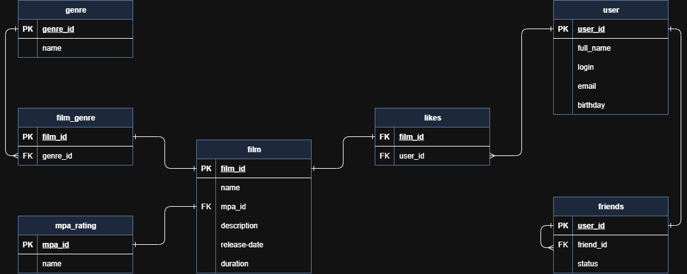

# java-filmorate
Filmorate is a backend service for managing movies and user ratings.

## _Database Structure Scheme_


## _Database Structure Description_<br>
PK (Primary Key) - первичный ключ<br>
FK (Foreign Key) - внешний ключ

**film**<br>
`film_id - PK INT` индификатор фильма<br>
`name - VARCHAR(100)` название фильма<br>
`mpa_id - FK INT` рейтинг Ассоциации кинокомпаний<br>
`description - VARCHAR(200)` описание фильма<br>
`release-date - DATE` дата реализа<br>
`duration` продолжительность фильма<br>

**map_rating**<br>
`mpa_id - PK INT` индификатор рейтинга<br>
`name - VARCHAR(8)` наименование рейтинга<br>

**genre**<br>
`genre_id - PK INT` индификатор жанра<br>
`name - VARCHAR(25)` наименование жанра<br>

**user**<br>
`user_id - PK INT` индификатор пользователя<br>
`full_name - VARCHAR(100)` Имя пользователя<br>
`login - VARCHAR(60)` Никнейм пользователя<br>
`email - VARCHAR(60)` Email пользователя<br>
`birthday - DATE` день рождения пользователя<br>

**friends**<br>
`user_id - PK INT` индификатор жанра<br>
`friend_id - FK INT` индификатор жанра<br>
`status - BOOLEAN` наименование жанра<br>

>Статус `status` для связи «дружба» между двумя пользователями:<br>
неподтверждённая — когда один пользователь отправил запрос на добавление другого пользователя в друзья,<br>
подтверждённая — когда второй пользователь согласился на добавление.

## _Examples of database queries:_
### Get all films with rating MPA
```
SELECT
    f.film_id,
    f.name AS film_name,
    f.description,
    f.release_date,
    f.duration,
    m.name AS mpa_rating
FROM film f
JOIN mpa_rating m ON f.mpa_id = m.mpa_id;
```
### Get films of a specific genre
```
SELECT 
    f.film_id,
    f.name AS film_name,
    f.description,
    g.name AS genre_name
FROM film f
JOIN film_genre fg ON f.film_id = fg.film_id
JOIN genre g ON fg.genre_id = g.genre_id
WHERE g.name = 'Комедия';
```
### Get all genres for film
```
SELECT 
    f.film_id,
    f.name AS film_name,
    g.name AS genre_name
FROM film f
JOIN film_genre fg ON f.film_id = fg.film_id
JOIN genre g ON fg.genre_id = g.genre_id
WHERE f.film_id = 1;
```
### Get the number of likes for each movie
```
SELECT
    f.film_id,
    f.name AS film_name,
    COUNT(l.user_id) AS likes_count
FROM film f
LEFT JOIN likes l ON f.film_id = l.film_id
GROUP BY f.film_id, f.name
ORDER BY likes_count DESC;
```
### TOP-5
```
SELECT 
    f.film_id,
    f.name AS film_name,
    COUNT(l.user_id) AS total_likes
FROM film f
JOIN likes l ON f.film_id = l.film_id
GROUP BY f.film_id, f.name
ORDER BY total_likes DESC
LIMIT 5;
```
### Find user and heir friends
```
SELECT
    u1.user_id,
    u1.full_name AS user_name,
    u2.user_id AS friend_id,
    u2.full_name AS friend_name,
FROM friends f
JOIN user u1 ON f.user_id = u1.user_id
JOIN user u2 ON f.friend_id = u2.user_id
WHERE u1.user_id = 1 OR u2.user_id = 1;
```